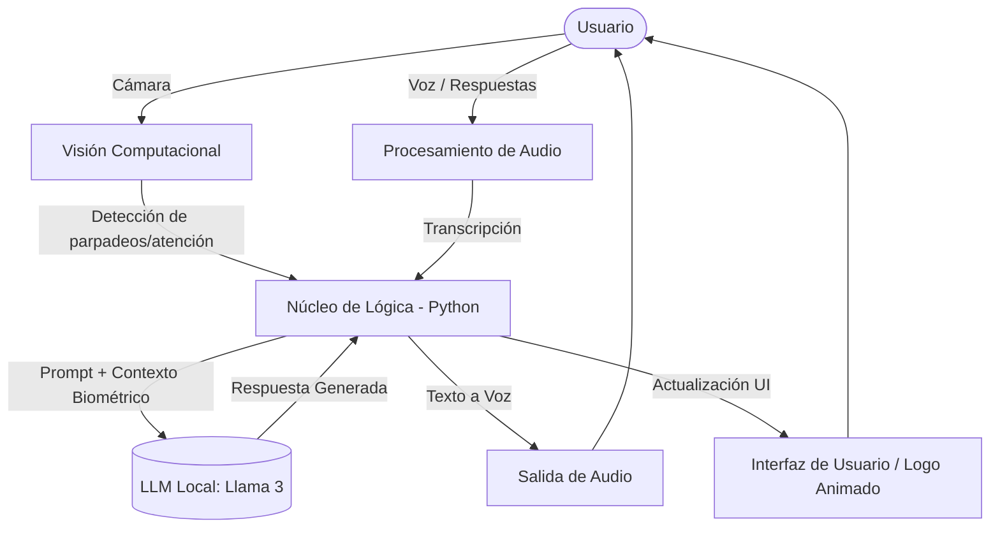

# Nira - AI Personal Instructor & Biometric Interviewer

Nira es una aplicación diseñada para simular entrevistas de estrés analizando la biometría del usuario y generando respuestas dinámicas. 

## Arquitectura del Sistema

A continuación se detalla cómo interactúan los diferentes módulos de inteligencia artificial y procesamiento:

### Estructura del Proyecto
/src: Código fuente principal de la aplicación.

/assets: Recursos visuales (incluyendo el logo SVG animado estilo minimalista-creativo).

/docs: Documentación adicional y pruebas de LLM.
